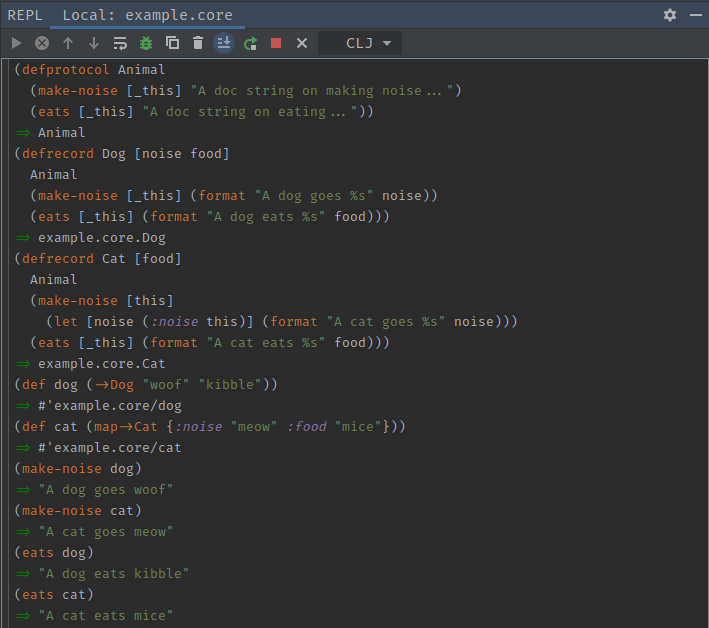

# Clojure Protocols
[*Documenation*](https://clojuredocs.org/clojure.core/defprotocol) <br>

Clojure protocols are very similar to an interface from an object oriented language.
Protocols define a set of methods that a [clojure record](clojure-records.md) can
implement.

```clojure
(defprotocol Animal
    (make-noise [_this] "A doc string on making noise...")
    (eats [_this] "A doc string on eating..."))

(defrecord Dog [noise food]
    Animal
    (make-noise [_this] (format "A dog goes %s" noise))
    (eats [_this] (format "A dog eats %s" food)))

(defrecord Cat [food]
    Animal
    (make-noise [this]
      (let [noise (:noise this)] ;; This field may be nil
            (format "A cat goes %s" noise)))
    (eats [_this] (format "A cat eats %s" food)))

; ... Some code
; ... Some code

(let [dog (->Dog "woof" "kibble")
      cat (map->Cat {:noise "meow" :food "mice"})] ;; We can overload the record here with fields not defined in record parameters
    (make-noise dog)
    (make-noise cat)
    (eats dog)
    (eats cat))
```

We can see here that the animal protocol has two methods, `make-noise` and
`eats`. Both of the records that implement this interface provide their own
method bodies for the function.

*Note:* See how the method parameter is `this`. This parameter refers to the record
which is just a clojure map. Because of this, we can pull the `noise` field out of the
map for the cat record instead of referencing it from the parameters. If there was no
noise field passed into the record map from the constructor then no field would be
available, and it would be nil. This is where we can start to see the advantages of
defining parameters when creating records. We have access to their variable without
pulling unknown values from a map.

## Advantages of protocols
- We can use protocols to bring polymorphism into clojure. Protocols are faster
than multi-methods as they dispatch on type rather than arguments calculated at
runtime.

## Disadvantages of protocols
- Not as flexible as multi-methods. Multi-methods allow us dispatch a function
on one or more values for added flexibility.

## Worked Example

