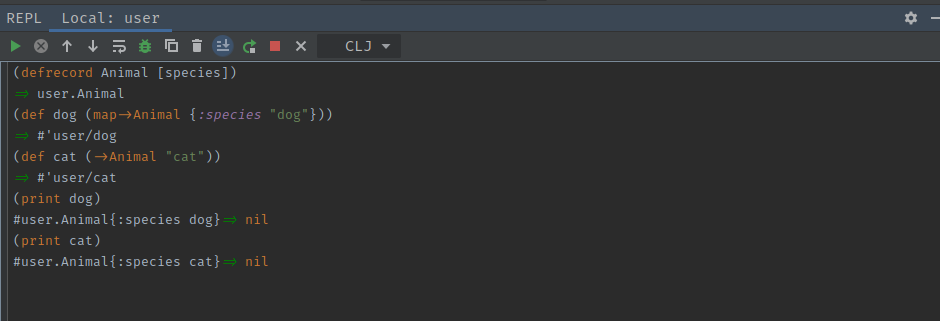
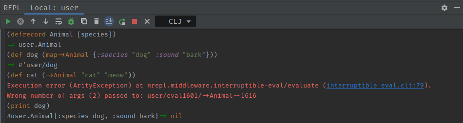
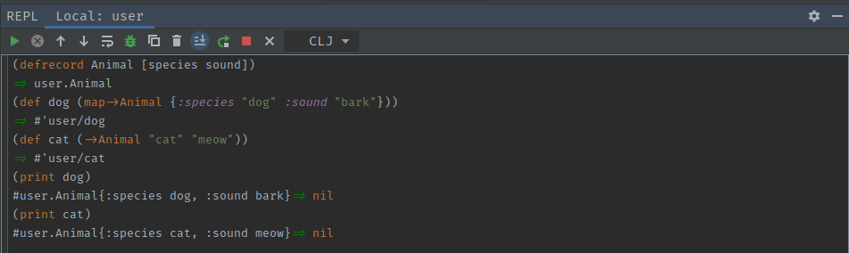

# Clojure Records
[*Documenation*](https://clojuredocs.org/clojure.core/defrecord) <br>

Clojure records are simply structured maps. An example of a regular clojure map
is: `{:species "dog"}`. This is perfectly fine to hold data in but is very "loose".
By loose I mean that we know very little about the object or what it contains at
runtime and are therefore limited to what operations we could perform on it. This
is where records can be used. The record for the above map may look something like
this:
```clojure
(defrecord Animal [species])

; ... Some code
; ... Some code

(let [dog (map->Animal {:species "dog"})
      cat (->Animal "cat")])
```

In the case of the code above, `Animal` is a record with a single field `species`.
- The dog variable is instantiated with a map. This will take the keys from the passed
map and map them to the parameters of the record, i.e. the species key from the dog
map is used to populate the species field in the record. This does not mean that we are
guaranteed to have a species field in the record as someone could pass any map to it, 
but it will at least give us an indication of what the record should contain.
- The cat variable is instantiated with positional arguments. This means that as
fields are passed to the record's constructor, i.e. `->Animal`, they will be mapped
to the corresponding positional  parameter field in the record.

Something that can help you to understand records is to think of their parameters
as instance variable to a class in an object oriented language. Since clojure is
generally immutable, we define record fields in the constructor and this is what
the values remain at.

## Advantages of positional arguments
- We don't load many unnecessary fields into the record as we are limited to the
number of parameters we can pass (must be the same as record parameters).

## Advantages of mapped arguments
- We can pass many attributed with a single argument keeping code concise.

## Worked Example
### Regular Example


### Overloaded Example


### Multi-Arity Record
