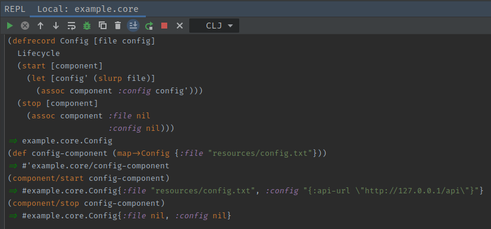
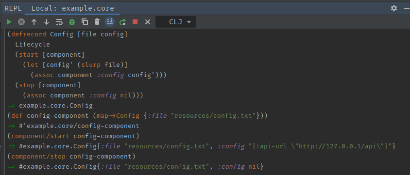

# Components
[*Documentation*](https://github.com/stuartsierra/component)

A clojure component is a representation of a part of a larger system of components
in a clojure program. The component library provides a `Lifecyle` protocol for
clojure records to implement. Once this protocol is implemented, the record can be
added to a [system map](composing-component-systems.md) to work with other components.

An example of a component might look something like this:

```clojure
(:require [com.stuartsierra.component :refer [Lifecycle]])

(defrecord Config [file config]
  Lifecycle
  (start [component]
    (let [config' (slurp file)]
      (assoc component :config config')))
  (stop [component]
    (assoc component :file nil
                     :config nil)))
```

We can see that this is just a simple [clojure record](clojure-records.md) that 
implements two methods from the Lifecyle protocol. This protocol is a special
protocol exposed from the component library that is capable of starting and
stopping a system.

## Starting Components
`start` - In this method, we setup the component and put anything in the component
map that we may think will be useful. This can range from something like a config
map like above to a running webserver. Whatever the return value of this function is
will be what the system runs with. In this case, the last line of a component generally
uses `assoc` to add something to the record map.

## Stopping Components
`stop` - In this method, we handle the logic required to shut down the component
gracefully. An important thing to note here is that we `assoc` nil into the component
map. This is because `dissoc` produces an empty map. It is better for us to explicitly
set our "instance" fields to nil instead. It is also important to note that you
should assoc all fields as nil including the `file` parameter. You may ask yourself why
this is the case since we do not `assoc` it into the component but remember, the
component is simply a record. When we create the record we pass the parameter into
it we have equal responsibility to handle it when cleaning up. This may seem trivial
fir a `:file` key but what if it was a memory intensive webserver... :bomb:

## Worked Example
### Full Shutdown


### Partial Shutdown (Avoid)
