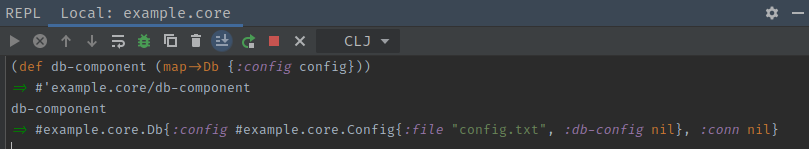
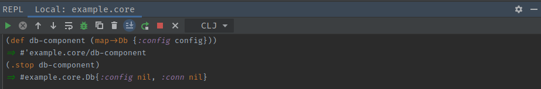
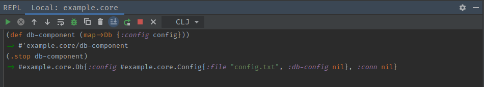

# Composing Component Systems
[*Documentation*](https://github.com/stuartsierra/component)

The component library is a lifecycle library written for clojure applications. It 
enforces a pattern that allows different parts of an application to speak with each 
other.

Component uses the idea of a "system" to encapsulate multiple running components
that all work together to for a system. A system map may look something like this:

```clojure
(:require [com.stuartsierra.component :as component]
          [app.components.config :refer [Config]]
          [app.components.db :refer [Db]])

(def system (component/system-map
              :config (map->Config {:file some-config-file})
              :db (component/using (map->Db nil) [:config])))

(alter-var-root #'system component/start)
```

In this example, we have a system which consists of two components:
- Config
- Db

The Config component will take in some configuration file and `slurp` it into an
edn map. This file will contain information about where to connect to a database
with data such as: 

```clojure
{:host "http://127.0.0.1"
 :port "5432"
 :username "admin"
 :password "my-super-secret-password"}
```

Once this information is read in and transformed, we will store it in the `:db-config`
key of the component.

We then move on to setting up the Db component. This will hold a connection to the
database. First, it must get the connectivity details. Since we don't want to
have to read in the file again, we pass the Config component into it. Through the
magic of components, the Db component map will not have a `:config` key inside it
which will hold a map that in turn contains the `:db-config` key. Our Db component can
extract this information to create its connection.

After the system map is defined, we call `alter-var-root` on it. This function takes
the system variable and changes its value to the result of `(components/start system)`.
You may read the code yourself for what this does but basically it iterates all the
components in the system in order and calls `(start component)` which replaces the 
record from the system map with a new instance of the record with the new information
that you assoc in the `start` method.

Similarly, the same thing is done with `(alter-var-root #'system component/stop)` when
we want to shut down the system gracefully. This would typically be done in a shutdown
hook.

In the case of the above system, the components would look like this:

```clojure
(:require [com.stuartsierra.component :refer [Lifecyle]])

(defrecord Config [file db-config]
  Lifecycle
  (start [component]
    (let [configuration (slurp file)]
      (assoc component :db-config configuration)))
  (stop [component]
    (assoc component :file nil
                     :db-config nil)))

(defrecord Db [config conn]
  Lifecycle
  (start [component]
    (let [db-conf (:db-config config)
          db-conn (create-connection! db-conf)]
      (assoc component :conn db-conn)))
  (stop [component]
    (stop! conn)
    (assoc component :config nil
                     :conn nil)))
```

## Stopping Components
As you can see in the example above, I have `assoc`'d nil into the config field
in the Db component. This may seem strange as in the `start` method I only `assoc`
the field `conn` into the component. We must be careful though. Since a record is
only a map, all of the fields passed into it must be cleaned up. This is the duty
of the person writing the `stop` method for the component.

 
 
In the above example, we can see that the config key is also populated in the
record map. If we do not `assoc` nil into the config passed into the component,
the value will remain in the record. A properly closed component should look
something like this:



We do not want a situation where this is what we code:

```clojure
(defrecord Db [config conn]
  Lifecycle
  (start [component]
    (let [db-conf (:db-config config)
          db-conn (create-connection! db-conf)]
      (assoc component :conn db-conn)))
  (stop [component]
    (stop! conn)
    (assoc component :conn nil)))
```

Here we can see that we do not put nil into the `config` key. This means that
the record will have configuration left in it.



While this may be harmless in the case of a small configuration component, it may
affect application performance when there is a system re-launching components often
that may have fields such as database connections or any other _heavy lifting_
features.